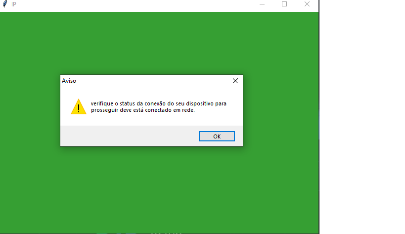
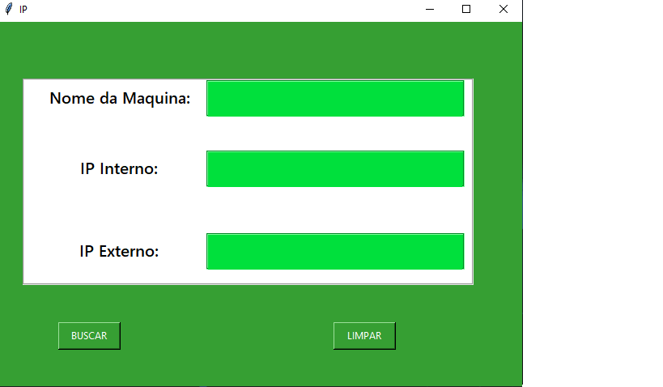

<h1 align="center">Captura de IP</h1>

  🚀  Programa para descobrir o Nome da Máquina , IP interno , IP Externo.  

 Ferramentas usadas: Tkinter para a criação da Interface .  Biblioteca requests e socket, além da API do ipify. Para descobrir o IP interno e externo da máquina .
  pip install sockets: https://pypi.org/project/sockets/  

  
   
Interface.😎

    
    
    
  

