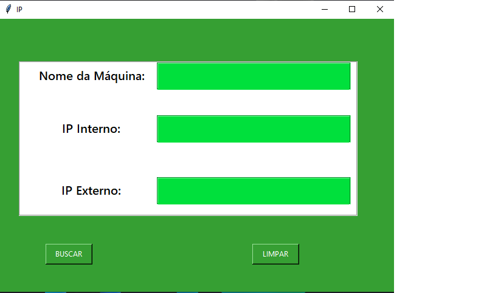

<h1 align="center">Captura de IP </h1>

  🚀  
Programa para descobrir o nome da máquina, IP interno, IP externo.
 

 Ferramentas usadas: Tkinter para a criação da interface biblioteca requests e socket, além da API do ipify para descobrir o IP interno e externo .

  pip install sockets: https://pypi.org/project/sockets/  

  
   
Interface.😎

    
    
    
  

